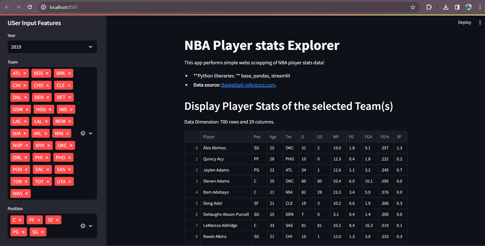
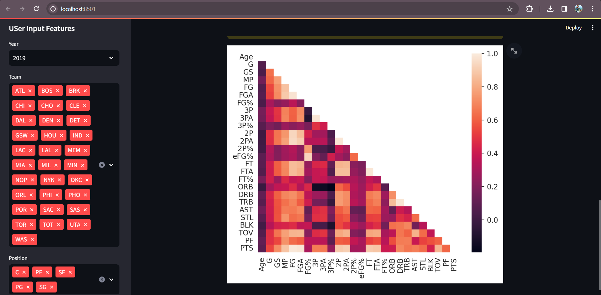

# NBA-Player-Stats-Explorer-Using-Streamlit

<h2><strong>This project is a simple NBA player stats explorer built with Streamlit. It allows users to visualize and analyze NBA player statistics.</strong></h2>

<h3><strong>1.</strong>To Run This Application in localhost</h3>

--->  "streamlit run Basketball-Player.py"

<h3><strong>2.</strong>Features</h3>

- Left side we have a sidebar for user input where user can selects "Year", "Team", "Position".

- Now, we can see detailed statistics for individual NBA players.

- Below the above section we also have option for "Download CSV file" and "Intercorrelation Heatmap"

- Clicking on the "Intercorrelation Heatmap" you can able to Heatmap of the selected Teams.

<h3><strong>3.</strong>Snapshots of Web application</h3>

 
 

 
 

<h3><strong>4.</strong>Prerequisites</h3>

Make sure you have the following installed:

<ul>Python (>3.6) </ul>
<ul>Streamlit</ul>
<ul>Pandas</ul>
<ul>Base64</ul>
<ul>Matplotlib</ul>
<ul>Seaborn</ul>
<ul>Numpy</ul>

